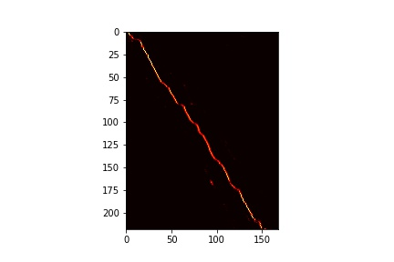

# Listen_Attend_Spell
This project is based on the following work: https://arxiv.org/pdf/1508.01211.pdf
Listen, Attend and Spell (LAS), is a neural network that learns to transcribe speech utterances to characters. Unlike traditional DNN-HMM models, this model learns all the components of a speech recognizer jointly. Our system has two components: a listener and a speller. The listener is a pyramidal recurrent network encoder that accepts filter bank spectra as inputs. The speller is an attentionbased recurrent network decoder that emits characters as outputs. The network produces character sequences without making any independence assumptions between the characters. This is the key improvement of LAS over previous end-toend CTC models. 

# RESULTING ATTENTION PLOT
Near convergence of training, the attention curve looks as below:

